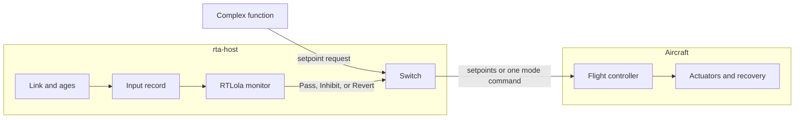
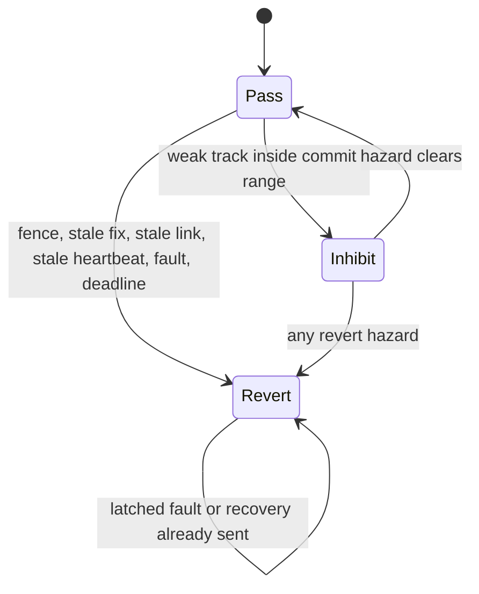
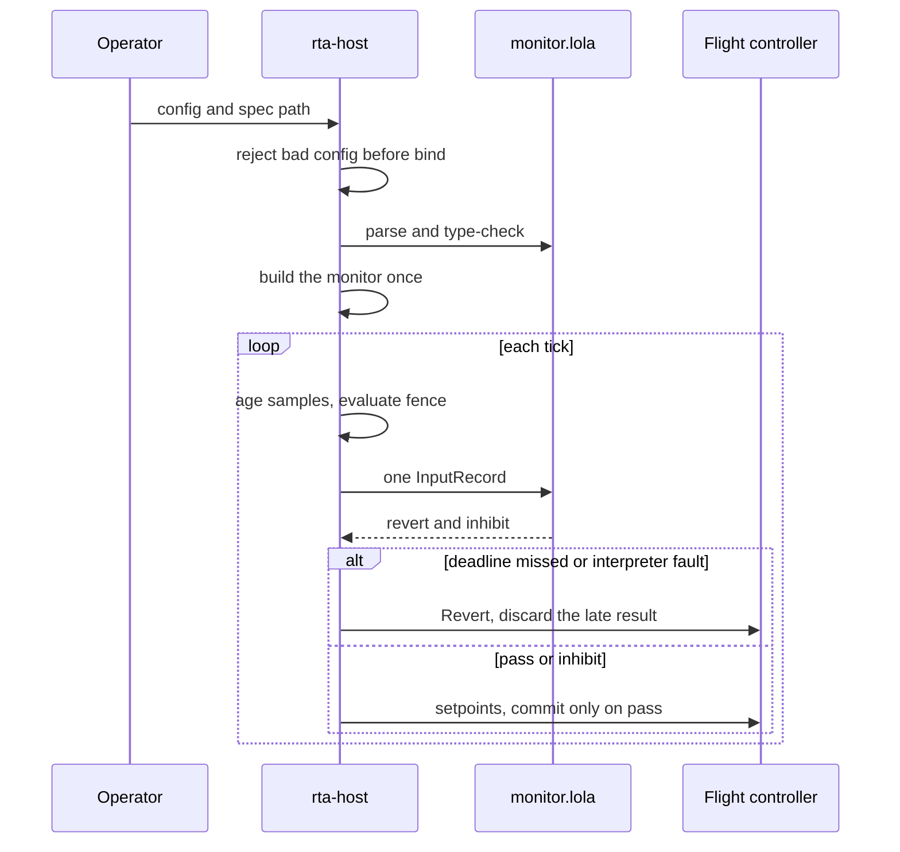

# AuToBoTs

Fail-closed runtime assurance for Group 1–3 aircraft. The flight controller owns the actuators and the recovery mode. A Rust host owns the clock, the link, and the switch. An RTLola specification owns every predicate. The complex function never reaches the socket.

This repository bounds flight and commit. It does not assure a tactical decision. It is not an authorizing-official package. It does not implement a weapon, a fuze, or a release actuator.

## How a tick works



The complex function may ask for a setpoint and a commit bit. It cannot send that request. `switch::decide` is the only constructor of an outbound command.

## Verdicts

`Revert` beats `Inhibit` beats `Pass`.



| Verdict | What leaves the switch |
| --- | --- |
| Pass | Setpoints. Commit only if the request already had it. |
| Inhibit | Setpoints. Commit forced off. |
| Revert | No setpoints. One recovery-mode command, then silence. |

Recovery mode comes from config: `rtl`, `loiter`, or `land`. The switch has no buried default.

## Workflow



A spec change is a process restart and a golden-trace review. There is no hot reload.

## What the tree does

| Piece | Where | State |
| --- | --- | --- |
| Workspace, pins, config | `Cargo.toml`, `docs/dependencies.md`, `config/example.toml` | On main |
| Hazard list and verdict map | `docs/hazards.md`, `docs/verdicts.md` | On main |
| Timing budget | `docs/timing.md` | On main |
| Input record | `rta-spec` | Rejects non-finite values |
| Stale samples | `rta-host` | Host ages, spec decides |
| Fence | `rta-host/src/fence.rs` | Trips on the stopping-distance margin |
| Monitor | `spec/monitor.lola` | Thresholds live here, not in Rust |
| Tick | `rta-host/src/eval.rs` | One record, one `accept_event` |
| Deadline | `rta-host/src/tick.rs` | Late pass is discarded |
| Switch | `rta-switch` | Setpoints or mode, never both |
| Link | `rta-host/src/link.rs` | UDP parses. Serial is not built. |
| Evidence | `scripts/evidence.sh` | SBOM and provenance hook |

Still open: a real MAVLink heartbeat sink, the watchdog thread, reported-mode dispatch, and fixture replay through the interpreter. Those issues stay open.

## Crates

- `rta-spec` holds the input record and the verdicts. No sockets.
- `rta-switch` is a pure function. No interpreter and no MAVLink.
- `rta-host` is the binary. Config, clock, interpreter, link, and log.
- `rta-replay` re-evaluates a tick log against the spec.

## Build

Rust 1.98.1, rustfmt, and clippy are pinned in `rust-toolchain.toml`.

```sh
cargo test --workspace
cargo clippy --workspace --all-targets -- -D warnings
cargo deny check
```

The example config is `config/example.toml`. A missing or invalid file exits before a socket. The predicate source is `spec/monitor.lola`.

## Read next

- [Hazards](docs/hazards.md)
- [Verdicts](docs/verdicts.md)
- [Timing](docs/timing.md)
- [Spec notes](docs/spec-notes.md)
- [Fence](docs/fence.md)
- [Interface](docs/icd.md)
- [Standards gate](docs/standards-3000-09-8430-01.md)
- [Task list](docs/engineering-tasks.md)
