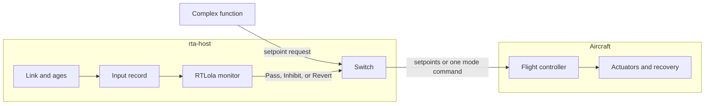
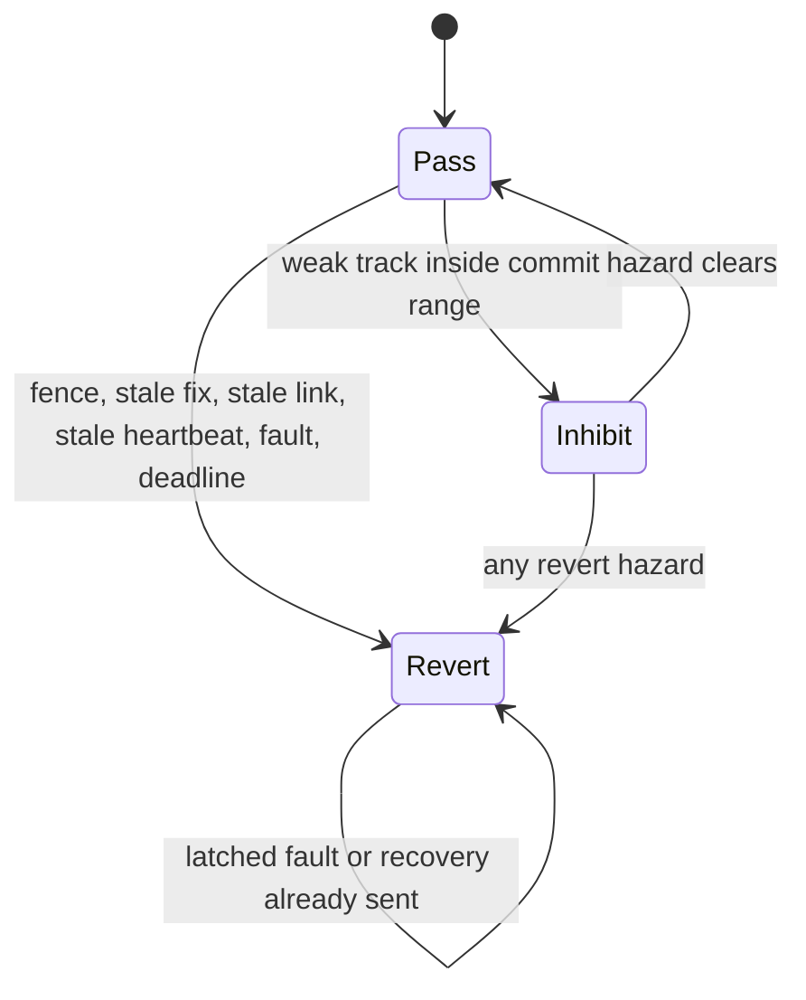
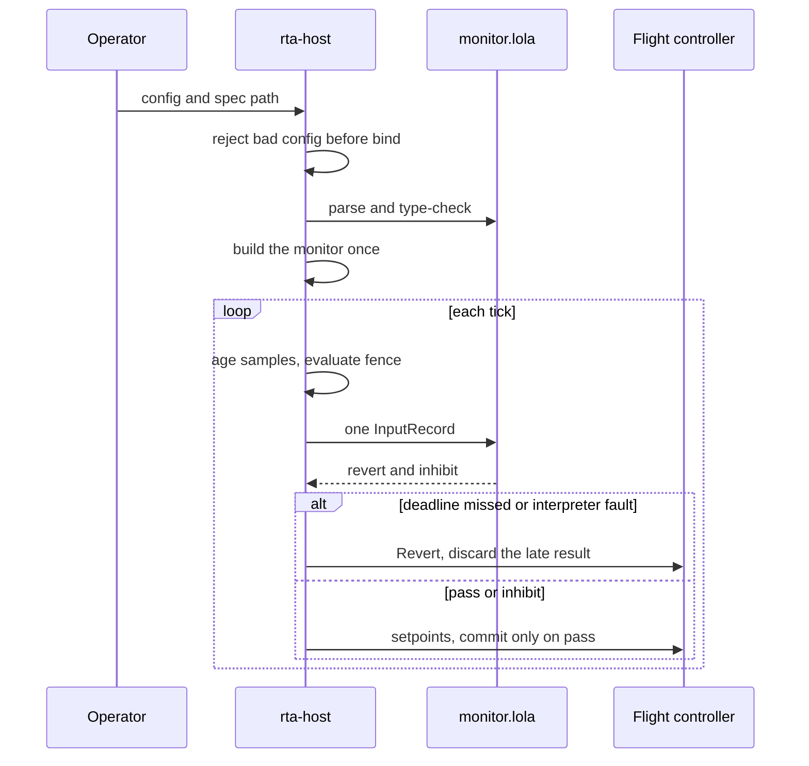
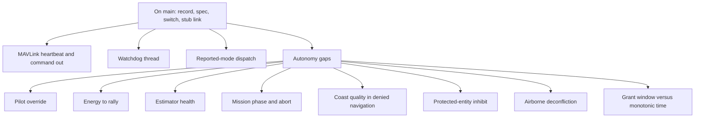

# AuToBoTs

Fail-closed runtime assurance for Group 1–3 aircraft. The flight controller owns the actuators and the recovery mode. A Rust host owns the clock, the link, and the switch. An RTLola specification owns every predicate. The complex function never reaches the socket.

This repository bounds flight and commit. It does not assure a tactical decision. It is not an authorizing-official package. It does not implement a weapon, a fuze, or a release actuator.

## How a tick works



The complex function may ask for a setpoint and a commit bit. It cannot send that request. `switch::decide` is the only constructor of an outbound command.

## Verdicts

`Revert` beats `Inhibit` beats `Pass`.



| Verdict | What leaves the switch |
| --- | --- |
| Pass | Setpoints. Commit only if the request already had it. |
| Inhibit | Setpoints. Commit forced off. |
| Revert | No setpoints. One recovery-mode command, then silence. |

Recovery mode comes from config: `rtl`, `loiter`, or `land`. The switch has no buried default.

## Workflow



A spec change is a process restart and a golden-trace review. There is no hot reload.

## What the tree does

| Piece | Where | State |
| --- | --- | --- |
| Workspace, pins, config | `Cargo.toml`, `docs/dependencies.md`, `config/example.toml` | On main |
| Hazard list and verdict map | `docs/hazards.md`, `docs/verdicts.md` | On main |
| Timing budget | `docs/timing.md` | On main |
| Input record | `rta-spec` | Rejects non-finite values |
| Stale samples | `rta-host` | Host ages, spec decides |
| Fence | `rta-host/src/fence.rs` | Trips on the stopping-distance margin |
| Monitor | `spec/monitor.lola` | Thresholds live here, not in Rust |
| Tick | `rta-host/src/eval.rs` | One record, one `accept_event` |
| Deadline | `rta-host/src/tick.rs` | Late pass is discarded |
| Switch | `rta-switch` | Setpoints or mode, never both |
| Link | `rta-host/src/link.rs` | UDP parses. Serial is not built. |
| Evidence | `scripts/evidence.sh` | SBOM and provenance hook |

## Missing features

These are not on `main`. The issues stay open until the acceptance tests exist.



| Feature | Why it is missing | Issue |
| --- | --- | --- |
| Reported-mode dispatch | Revert should send the recovery mode only when the flight controller is not already in it. | [#17](https://github.com/MatthewK84/AuToBoTs/issues/17) |
| No-verdict path | A tick with no verdict must call the switch as `Revert`. | [#18](https://github.com/MatthewK84/AuToBoTs/issues/18) |
| Watchdog thread | Missed published ticks must command recovery without calling the interpreter. | [#19](https://github.com/MatthewK84/AuToBoTs/issues/19) |
| MAVLink heartbeat | The companion must be visible to the flight controller within 1.5 s. The link only stub-binds. | [#20](https://github.com/MatthewK84/AuToBoTs/issues/20) |
| Dialect state inputs | Position and heartbeat message ids are not written in `docs/mavlink.md`. | [#21](https://github.com/MatthewK84/AuToBoTs/issues/21) |
| Tracker port | Confidence and range need a fake tracker trait. No video decode. | [#22](https://github.com/MatthewK84/AuToBoTs/issues/22) |
| Command out | Mode and setpoints are not yet dialect messages. | [#23](https://github.com/MatthewK84/AuToBoTs/issues/23) |
| Fixture replay | `spec/fixtures/verdicts.json` is not yet run through the interpreter. | M7.3 |
| Pilot override | A stick, a mode change, or RC takeover must beat the companion in the same tick. | [#179](https://github.com/MatthewK84/AuToBoTs/issues/179) |
| Energy to rally | Revert while the rally is still reachable, not after it is not. | [#180](https://github.com/MatthewK84/AuToBoTs/issues/180) |
| Estimator health | A fresh wrong position is only an age today. | [#181](https://github.com/MatthewK84/AuToBoTs/issues/181) |
| Mission phase | Search, track, commit, and abort are not states the monitor can see. | [#182](https://github.com/MatthewK84/AuToBoTs/issues/182) |
| Abort of a sent commit | Withdraw stops the next tick. The command already on the wire has no cancel. | [#183](https://github.com/MatthewK84/AuToBoTs/issues/183) |
| Denied navigation | No coast-quality or inertial-only input. | [#184](https://github.com/MatthewK84/AuToBoTs/issues/184) |
| Protected-entity inhibit | No no-strike list and no second-track miss. | [#185](https://github.com/MatthewK84/AuToBoTs/issues/185) |
| Airborne deconfliction | Nothing looks at another aircraft. | [#186](https://github.com/MatthewK84/AuToBoTs/issues/186) |
| Grant time | The tick clock is monotonic. A grant window is wall time. | [#187](https://github.com/MatthewK84/AuToBoTs/issues/187) |
| Evidence pack | SBOM, provenance, log redaction, and the human-accountability line are hooked, not a compliance claim. | [#188](https://github.com/MatthewK84/AuToBoTs/issues/188) |


## Crates

- `rta-spec` holds the input record and the verdicts. No sockets.
- `rta-switch` is a pure function. No interpreter and no MAVLink.
- `rta-host` is the binary. Config, clock, interpreter, link, and log.
- `rta-replay` re-evaluates a tick log against the spec.

## Build

Rust 1.98.1, rustfmt, and clippy are pinned in `rust-toolchain.toml`.

```sh
cargo test --workspace
cargo clippy --workspace --all-targets -- -D warnings
cargo deny check
```

The example config is `config/example.toml`. A missing or invalid file exits before a socket. The predicate source is `spec/monitor.lola`.

## Read next

- [Hazards](docs/hazards.md)
- [Verdicts](docs/verdicts.md)
- [Timing](docs/timing.md)
- [Spec notes](docs/spec-notes.md)
- [Fence](docs/fence.md)
- [Interface](docs/icd.md)
- [Standards gate](docs/standards-3000-09-8430-01.md)
- [Task list](docs/engineering-tasks.md)
